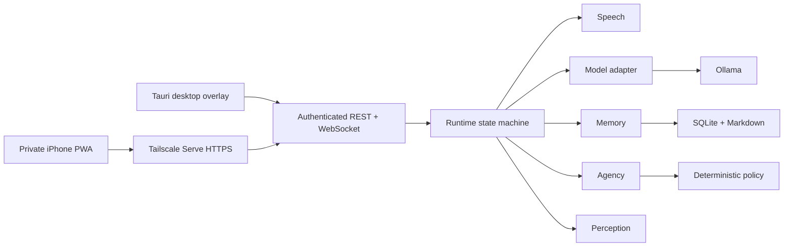

# JARVIS architecture

JARVIS is a modular monolith with one authoritative Python process, one shared React client, and a thin Tauri host. The transport is a seam, not a second business-logic layer.

## Module ownership

- `runtime` owns lifecycle, foreground conversation state, cancellation, event ordering, device transfer, and resource governance.
- `speech` owns wake detection, the RAM-only rolling buffer, VAD, transcription, synthesis, playback, interruption, and privacy modes.
- `memory` owns source events, retrieval, consolidation, conflicts, correction, forgetting, export, restore, and derived indexes.
- `agency` owns capabilities, deterministic policy, approvals, execution, undo, schedules, proactivity, and audit records.
- `perception` owns typed snapshots of screen, windows, files, processes, browser state, and system health.
- `platform` owns transport and replaceable vendor/OS adapters. It contains no product decisions.
- `bootstrap.py` is the sole composition root. Product modules accept dependencies and never construct vendor implementations internally.

## Dependency direction

`runtime` coordinates module interfaces. Product modules may depend on protocol value types, but never on FastAPI, Ollama, SQLModel, Tailscale, Playwright, Windows UI Automation, or Tauri. Those dependencies point inward through adapters assembled in `bootstrap.py`.

The React client consumes generated protocol types. It never defines a competing transport schema. The Tauri host supervises processes and windows but does not duplicate runtime state or permission decisions.

## Persistence

SQLite is the transactional system of record, configured with foreign keys, WAL mode, bounded busy timeouts, crash-safe transactions, and one application writer. Human-editable durable knowledge is mirrored to Markdown. FTS and embeddings are derived, versioned, and rebuildable. Secrets live only in Windows Credential Manager.

## Authorization invariant

Every capability invocation reaches the deterministic policy engine immediately before execution, including scheduled work. The model can propose an invocation but cannot grant permission, manufacture approval evidence, or execute around the capability registry.

## Public protocol

Pydantic models are the source of truth for versioned REST and WebSocket contracts. Every live event has an event ID, session ID, optional turn ID, monotonic per-session sequence, timestamp, type discriminator, and typed payload. Binary WebSocket frames are PCM audio only and are valid only while an authenticated audio stream is open.

## Resource invariant

Only one heavy local model may be resident. JARVIS may unload or fall back, but it never closes user applications, changes GPU preferences, or hides resource pressure. Queues, prompts, captures, subprocess output, and audio buffers are bounded.
