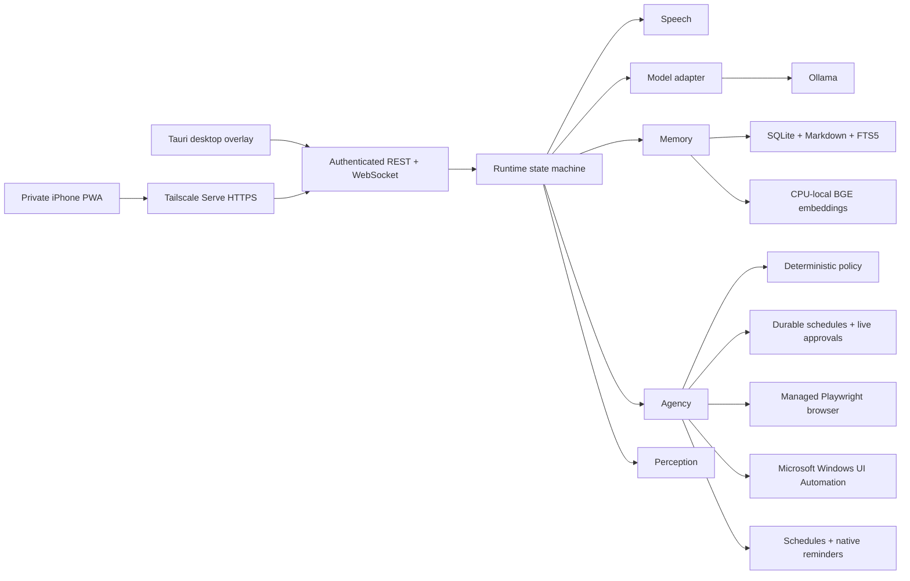

# JARVIS architecture

JARVIS is a modular monolith with one authoritative Python process, one shared React client, and a thin Tauri host. The transport is a seam, not a second business-logic layer.

## Module ownership

- `runtime` owns lifecycle, foreground conversation state, cancellation, event ordering, device transfer, and resource governance.
- `speech` owns wake detection, the RAM-only rolling buffer, VAD, transcription, synthesis, playback, interruption, and privacy modes.
- `memory` owns source events, retrieval, consolidation, conflicts, correction, forgetting, export, restore, and derived indexes.
- `agency` owns capabilities, deterministic policy, approvals, execution, undo, schedules, proactivity, and audit records.
- `perception` owns typed snapshots of screen, windows, files, processes, browser state, and system health.
- `platform` owns transport and replaceable vendor/OS adapters. It contains no product decisions.
- `bootstrap.py` is the sole composition root. Product modules accept dependencies and never construct vendor implementations internally.

## Implemented control paths

- Browser observation and operation use a JARVIS-owned persistent Edge profile. Model-facing targets are restricted to accessibility roles, labels, placeholders, and visible text; arbitrary selectors and page-script execution are not exposed.
- Durable APScheduler jobs are reconstructed from validated SQLite records. Each run re-enters the capability coordinator and policy engine. External actions produce a fresh approval that is broadcast to authenticated live clients and replayed after reconnection until resolved.
- Memory retrieval fuses SQLite FTS5 results with CPU-local BGE-small embeddings. Embedding rows contain no canonical facts, can be deleted and rebuilt, and fall back to lexical retrieval if the embedding runtime is unavailable.
- Screen context is captured only for an explicit or contextually necessary active turn, compressed to a bounded in-memory image, marked as untrusted visual evidence, and never persisted by the context pipeline.
- Foreground desktop operation uses Microsoft's UI Automation control patterns through the bounded `winapp` CLI adapter. Exact foreground-window handles, typed selectors, timeouts, output limits, and the policy engine constrain every operation; raw input injection is not exposed.
- Explicit private, meeting, lecture, and ambient-memory modes share one speech state machine. Ambient transcripts cannot invoke the assistant or authorize actions.
- Durable memory writes carry the originating conversation event, queue conflicts without overwrite, and expose exact audited undo references. Scheduled reminders re-enter policy and surface through both the overlay and native Windows notifications.
- SQLite is backed up transactionally at startup and daily with bounded retention. Packaged logs are rotating structured JSON with credential redaction. Build artifacts include separate CycloneDX SBOMs for Python, Node, and Rust.
- The Python core, browser, scheduler, model residency, and SQLite store share one ordered application lifecycle so startup rollback and shutdown do not strand background work.

## Dependency direction

`runtime` coordinates module interfaces. Product modules may depend on protocol value types, but never on FastAPI, Ollama, SQLModel, Tailscale, Playwright, Windows UI Automation, or Tauri. Those dependencies point inward through adapters assembled in `bootstrap.py`.

The React client consumes generated protocol types. It never defines a competing transport schema. The Tauri host supervises processes and windows but does not duplicate runtime state or permission decisions.

## Persistence

SQLite is the transactional system of record, configured with foreign keys, WAL mode, bounded busy timeouts, crash-safe transactions, and one application writer. Human-editable durable knowledge is mirrored to Markdown. FTS and embeddings are derived, versioned, and rebuildable. Embedding model weights live in JARVIS-managed application data rather than the repository or installer. Secrets live only in Windows Credential Manager.

## Authorization invariant

Every capability invocation reaches the deterministic policy engine immediately before execution, including scheduled work. The model can propose an invocation but cannot grant permission, manufacture approval evidence, or execute around the capability registry.

## Public protocol

Pydantic models are the source of truth for versioned REST and WebSocket contracts. Every live event has an event ID, session ID, optional turn ID, monotonic per-session sequence, timestamp, type discriminator, and typed payload. Binary WebSocket frames are PCM audio only and are valid only while an authenticated audio stream is open.

## Resource invariant

Only one heavy local model may be resident. JARVIS may unload or fall back, but it never closes user applications, changes GPU preferences, or hides resource pressure. Queues, prompts, captures, subprocess output, and audio buffers are bounded.
