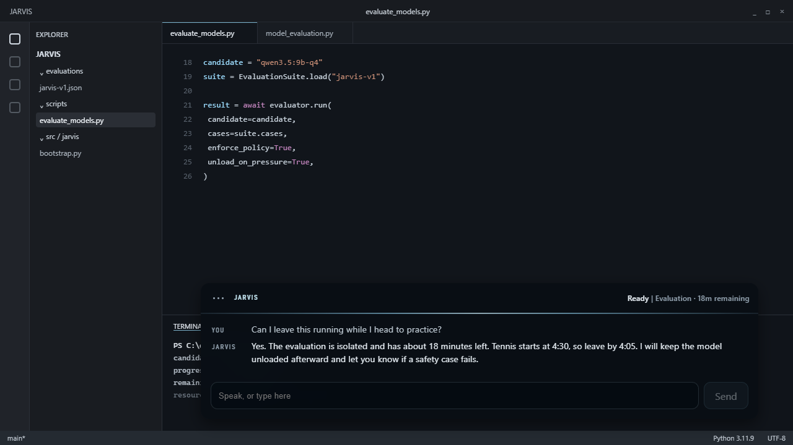
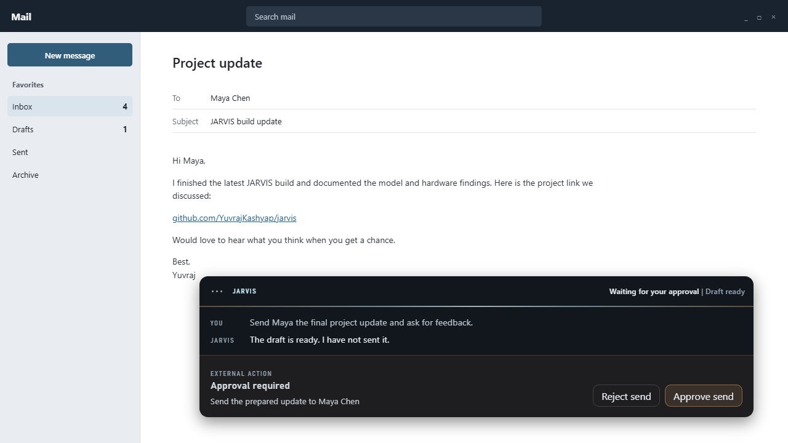
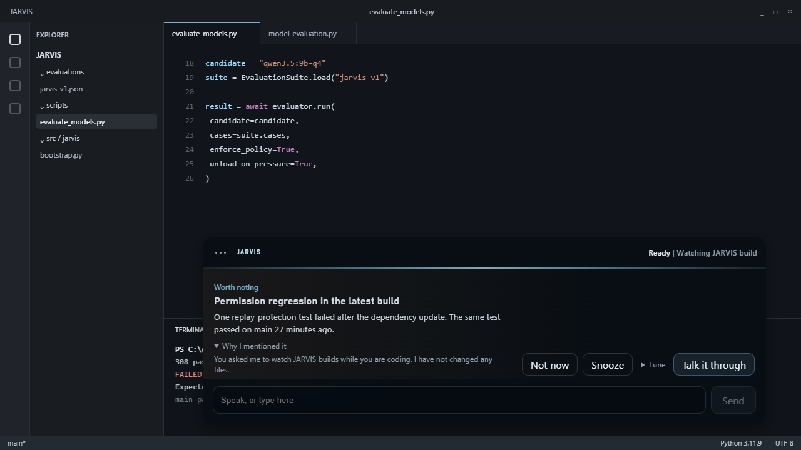
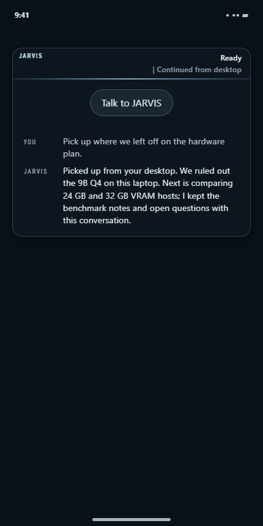
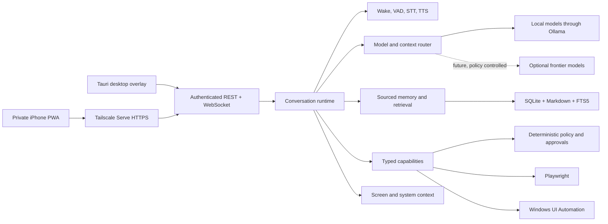

# JARVIS

### One personal intelligence across models, tools, memory, and devices

JARVIS is my attempt to build the closest practical version of the assistant from the *Iron Man* films: always available, aware of the current situation, able to remember, able to act, and consistent across every interaction.

It is an agentic harness rather than a chatbot tied to one model. JARVIS owns the identity, conversation, memory, perception, permissions, tools, voice, and device handoff. Local, specialized, and eventually frontier models are replaceable sources of intelligence inside that system.

> **Current status: paused at the hardware qualification gate.** The system foundation is implemented and the software verification suite passes. Daily use is paused because this laptop's 16 GB of system memory cannot keep the minimum capable local model resident beside a normal workload without unsafe memory pressure. I understand that limit and am looking at better hardware that can host the much more capable JARVIS this design calls for. [STATUS.md](STATUS.md) contains the measurements and continuation plan.



## The outcome

The goal is to remove the gap between having an intention and getting a trustworthy result.

I should be able to say "Hey JARVIS" without opening an application, explain as little as possible, and continue from the context already on screen and in memory. JARVIS should investigate, reason, ask for approval when required, carry out the work, and show what changed. It should stop when interrupted, remember what matters, and remain the same assistant on my computer, phone, and future devices.

The cinematic reference is about the relationship and operating model, not a visual imitation. JARVIS should feel present instead of launched, capable instead of chat-only, proactive without becoming annoying, and powerful without taking control away from me.

## What JARVIS is

- **An ambient interface.** A transparent Windows overlay, local wake-word pipeline, streamed speech, interruption, and private, meeting, lecture, and ambient-memory modes.
- **A second brain.** Sourced conversations and durable facts, human-readable Markdown, local retrieval, conflict review, correction, forgetting, export, backup, and recovery.
- **A chief of staff.** Ongoing objectives, reminders, schedules, project awareness, restrained suggestions, and follow-up without constant prompting.
- **A computer operator.** Screen context, managed browser control, Windows UI Automation, bounded process execution, typed actions, cancellation, and undo.
- **A policy-controlled agent.** Models can reason and propose work. Deterministic code decides whether an action is allowed, requires approval, or is forbidden.
- **One identity across devices.** The Windows overlay and private iPhone PWA share the same runtime, memory, conversation, and authorization state.
- **An owned runtime.** Local process supervision, authenticated transport, device pairing, persistence, recovery, diagnostics, packaging, and autostart keep the system independent from a hosted chat product.

## The agentic harness

JARVIS sits above the models. It gives them context, exposes only relevant capabilities, validates proposed actions, records real results, and keeps the conversation coherent across multi-step work.

The long-term router should choose among:

- local general models for private, offline, and routine work;
- stronger local models when the hardware has enough headroom;
- specialist models for speech, vision, retrieval, coding, or planning;
- optional frontier models when a task genuinely needs more intelligence and the privacy, authorization, network, and cost rules permit it.

The routing decision should use capability, modality, sensitivity, latency, resource pressure, availability, and cost. I can still say "keep this local" or "use the strongest model available." JARVIS should explain what it used and why when asked.

Frontier routing is part of the destination, not the current build. Today the approved runtime is local and free. A future provider adapter must never receive sensitive information by default, and no provider gets to own JARVIS's memory, identity, permissions, or history.

## Built around one person

This is not a generic assistant with my name in the system prompt. The complete system is meant to be shaped around how I think, speak, work, decide, and use my devices.

| Layer | What is customized |
| --- | --- |
| Identity | One consistent personality, conversational style, relationship history, and behavioral contract across every model |
| Memory | Personal facts, preferences, people, projects, decisions, unfinished work, provenance, corrections, and forgetting rules |
| Voice | A private original voice, pronunciation guide, delivery controls, and a personalized wake phrase |
| Context | My applications, active projects, screen state, files, routines, devices, and current objective |
| Tools | Typed actions for the programs and workflows I actually use, with personal defaults and standing rules |
| Agency | Personal approval thresholds, reversible actions, audit history, undo, quiet hours, and proactive-assistance preferences |
| Interface | A responsive desktop overlay and phone companion that follow the same conversation rather than behaving like separate products |
| Intelligence | Replaceable base models, JARVIS-specific prompts and context assembly, routing policy, and evaluated local model adaptations |

Personalization is not permission. Knowing more about me does not give JARVIS more authority. Memory, action policy, and model behavior are separate parts of the system so each can be inspected, corrected, tested, or replaced.

## Local model engineering

Finding a base model is the beginning, not the end. Once better hardware is available, the local intelligence track will:

1. Benchmark capable open-weight multimodal models under the complete always-on workload.
2. Select the strongest base model that passes quality, latency, tool-use, and resource gates.
3. Build curated training sets for JARVIS behavior, tool selection, typed arguments, recovery, uncertainty, concise dialogue, and permission discipline.
4. Train LoRA or QLoRA adapters and test other lawful parameter-efficient adaptation methods where they improve the measured result.
5. Compare every adapted model against the untouched baseline and reject changes that weaken general reasoning, safety, latency, or reliability.
6. Package the chosen model and adapter behind the same replaceable model interface used by the rest of JARVIS.

Fine-tuning is for stable behavior and task skill. It is not the storage system for changing personal facts. Current knowledge about my life remains in sourced memory where I can inspect, correct, delete, export, and rebuild it. This separation allows the model to become better suited to JARVIS without turning its weights into an opaque personal database.

## Product surfaces

### Approval is enforced outside the model

Every action re-enters a deterministic policy engine immediately before execution. The model can propose work, but it cannot authorize itself, forge approval evidence, or report an action as completed without a capability result.



### JARVIS can notice what matters

Proactivity is tied to authorized events and personal preferences. JARVIS can watch a build, notice that a permission guarantee regressed, explain why it interrupted, and offer to help. It does not change files or take the next action unless I ask.



### The phone reaches the same JARVIS

The installable iPhone PWA connects privately through Tailscale to the laptop-authoritative runtime. It uses a one-use pairing offer, a non-exportable P-256 device key, signed session challenges, and the same live conversation protocol as the desktop. If the laptop is unreachable, the phone says JARVIS is unavailable instead of substituting another assistant.

<p align="center">
  
</p>

## Architecture



The codebase is a compact modular monolith: one authoritative Python process, one shared React client, and a thin Rust/Tauri Windows host. Pydantic models are the protocol source of truth, and generated TypeScript contracts are checked for drift. [`src/jarvis/bootstrap.py`](src/jarvis/bootstrap.py) is the only composition root.

The infrastructure work is part of the product. The repository includes Windows sidecar supervision, authenticated desktop and phone transport, device-key pairing, database migrations, transactional backups, recovery, rotating redacted logs, dependency audits, SBOM generation, installer packaging, and separate software and physical acceptance gates. Those pieces are what allow the agent, memory, and tools to operate as one long-running system instead of a collection of demos.

## Measured engineering status

### Software verification

| Layer | Fresh result |
| --- | ---: |
| Python | 308 tests passed |
| React / TypeScript | 63 tests passed |
| Rust / Tauri | 20 tests passed |
| Python coverage | 86.59% |
| Formatting, linting, typing, contract drift, builds | Passed |

Run the complete software gate with `pnpm verify`.

### What the current hardware proved

| Candidate | Observation | Decision |
| --- | --- | --- |
| Qwen3.5 4B Q4 | Loaded under the normal workload; available system RAM fell from about 1.68 GiB to 0.66 GiB | Automatically unloaded; failed the 1 GiB safety floor |
| Qwen3.5 9B Q4 | Required 87.8 seconds for its first response and left about 219 MiB available | Failed responsiveness and resource safety |
| 4B Q8 and current 8B-9B candidates | Evaluation infrastructure is ready | Deferred until a higher-memory host can test them safely |

The current machine is an HP OMEN laptop with an RTX 4060 Laptop GPU, 8 GB VRAM, and 16 GB DDR5-4800 system memory. The 4B test still had GPU capacity, but system-memory headroom was exhausted. The final workload includes wake detection, speech recognition, voice synthesis, screen perception, retrieval, the desktop host, and normal applications, all of which need to remain responsive at the same time.

My conclusion is that a small memory upgrade would not match the ambition of this project. The next host should have at least 24 GB of VRAM and 64 GB of system memory. The preferred target is 32 GB of VRAM and 96 GB or more of system memory. That target creates room for a materially stronger 20B-30B multimodal model, useful context, the complete JARVIS runtime, and an ordinary desktop workload without building the product around constant unloading and memory pressure. Exact model selection will still be based on measured tests, not hardware specifications alone.

## What is not finished

This repository does not claim that JARVIS is ready for daily use today.

- No local model has passed the complete intelligence, tool-use, latency, and resource suite on this hardware.
- The original private voice has not been selected or acoustically accepted.
- Full-duplex wake, echo, interruption, and room-level false-wake testing remain physical tests.
- The iPhone path is implemented but has not completed physical-device acceptance.
- One-hour active and eight-hour idle soak tests wait on the final model and voice configuration.

The project resumes on higher-memory hardware, reruns the permanent candidate suite, selects only a passing model, and then completes voice, phone, acoustic, and soak acceptance. Frontier inference will remain optional. Normal operation must still have a local path, and sensitive work stays local unless I explicitly approve a narrower policy.

## Stack

| Concern | Technology |
| --- | --- |
| Native host | Rust, Tauri 2, WebView2 |
| Intelligence and control plane | Python 3.11, FastAPI, Pydantic, asyncio |
| Shared desktop/phone interface | React 19, TypeScript, Vite, PWA |
| Local model runtime | Ollama with benchmark-selected GGUF candidates |
| Speech | openWakeWord, Silero VAD, faster-whisper, Chatterbox |
| Memory | SQLite, SQLModel/SQLAlchemy, FTS5, Markdown, FastEmbed/BGE-small |
| Computer operation | Playwright, Windows UI Automation, bounded native/process adapters |
| Private phone networking | Tailscale Serve HTTPS, P-256 device identities |
| Verification | pytest, Hypothesis, Vitest, Testing Library, Playwright, Clippy |

## Run the software and demo surfaces

Prerequisites are Windows 11, Python 3.11, uv, Node.js, pnpm, stable Rust/MSVC, WebView2, and Ollama. Tailscale is needed only for private phone access.

```powershell
pnpm bootstrap          # install locked Python, JavaScript, and Rust dependencies
pnpm dev                # run the Tauri host, Python core, and shared UI
pnpm verify             # run the complete software correctness gate
pnpm preflight          # print local readiness and remaining acceptance gates
pnpm model:evaluate     # evaluate installed candidates without forcing a load
pnpm showcase:capture   # reproduce every README screenshot from real UI components
pnpm package            # build the sidecar and unsigned Windows installer
```

`pnpm acceptance` is intentionally stricter than `pnpm verify`. It exits unsuccessfully until model quality, installed-product, speech, physical iPhone, acoustic, and soak evidence all exist.

## Repository guide

```text
src/jarvis/   Python intelligence, memory, agency, perception, and platform adapters
ui/           Shared React desktop overlay, iPhone PWA, and reproducible showcase
src-tauri/    Thin Windows host, supervisor, tray, autostart, and native placement
evaluations/  Permanent model-quality and authorization evaluation set
tests/        Module, protocol, integration, attack, recovery, and UI tests
scripts/      Bootstrap, verification, benchmark, acceptance, packaging, and media capture
docs/assets/  Reproducible public product screenshots only
```

Start with [NORTHSTAR.md](NORTHSTAR.md) for the intended experience, [project_spec.md](project_spec.md) for approved behavior, [ARCHITECTURE.md](ARCHITECTURE.md) for implementation decisions, and [STATUS.md](STATUS.md) for the current handoff.

## Privacy and publication boundary

The public repository contains product code and sanitized demonstration media only. Personal memory, conversations, credentials, pairing material, private voice references, raw screenshots, recordings, databases, logs, model weights, and machine-specific runtime state stay outside Git. Secrets live in Windows Credential Manager. Idle audio exists only in a bounded RAM buffer and is continuously overwritten.

The source is publicly visible for engineering review and portfolio use. No license currently grants redistribution or commercial use.
