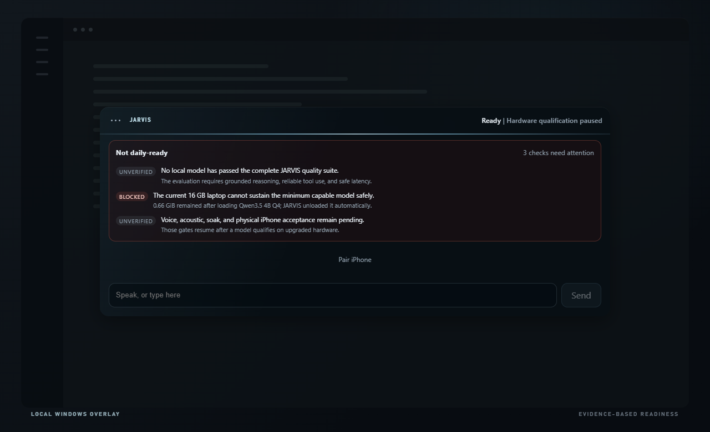
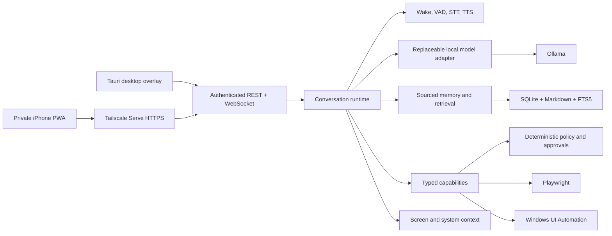

# JARVIS

### A local-first personal intelligence for Windows and iPhone

JARVIS is an ambient desktop assistant, persistent memory system, private phone companion, and policy-gated computer operator. It is designed as one continuous intelligence that can understand the current screen, remember prior context, propose and perform authorized work, and remain reachable without opening a conventional AI application.

> **Project status — paused at the hardware qualification gate.** The system foundation is implemented and its software verification is green. Daily intelligent operation is intentionally paused because this laptop's 16 GB of system memory cannot keep the minimum capable local model resident alongside an ordinary workload without unsafe memory pressure. Development will continue on higher-memory hardware. See [STATUS.md](STATUS.md) for the measurements and resume criteria.


## What makes this more than a chatbot

JARVIS is built as a private control plane around replaceable models—not as a prompt wrapped around one model provider.

- **Ambient interaction:** a transparent Tauri overlay, local wake-word pipeline, streamed transcription and synthesis, interruption, and explicit private/meeting/lecture modes.
- **Persistent, inspectable memory:** sourced conversations and facts in SQLite, human-readable Markdown, FTS5 and rebuildable local embeddings, conflict review, correction, forgetting, export, backup, and recovery.
- **Grounded perception:** active-window context, explicit screenshots, system health, managed browser state, and structured Windows UI Automation.
- **Safe agency:** typed capabilities, deterministic authorization outside the model, just-in-time approvals, bounded execution, cancellation, audit history, and undo references.
- **One identity across devices:** a shared React interface and authenticated WebSocket protocol for the Windows overlay and tailnet-only iPhone PWA.
- **Honest readiness:** installed dependencies and downloaded weights never count as proof. Model quality, resource safety, speech, phone, recovery, and physical acceptance are separate evidence gates.

## Product surfaces

### Approval is enforced outside the model

Every action re-enters a deterministic policy engine immediately before execution. The model can propose work, but it cannot authorize itself, forge approval evidence, or report an action as completed without a capability result.


### Readiness is evidence, not optimism

The authenticated diagnostics surface distinguishes prerequisites, degraded subsystems, unverified physical tests, and hard blockers. In the measured run below, JARVIS loaded Qwen3.5 4B Q4, detected that available RAM fell to 0.66 GiB, and unloaded the model automatically.



### The phone is another doorway into the same JARVIS

The installable iPhone PWA connects privately through Tailscale to the laptop-authoritative runtime. It uses a one-use pairing offer, a non-exportable P-256 device key, signed session challenges, and the same live conversation protocol as the desktop. If the laptop is unreachable, the phone explicitly shows JARVIS as unavailable rather than substituting another assistant.

<p align="center">
  
</p>

## Architecture



The codebase is a compact modular monolith: one authoritative Python process, one shared React client, and a thin Rust/Tauri Windows host. Pydantic models are the protocol source of truth; generated TypeScript contracts are checked for drift. [`src/jarvis/bootstrap.py`](src/jarvis/bootstrap.py) is the only composition root.

## Measured engineering status

### Software verification

| Layer | Fresh result |
| --- | ---: |
| Python | 308 tests passed |
| React / TypeScript | 60 tests passed |
| Rust / Tauri | 20 tests passed |
| Python coverage | 86.59% |
| Formatting, linting, typing, contract drift, builds | Passed |

The TypeScript total includes the three recruiter-showcase tests added with this documentation pass. Run the complete gate with `pnpm verify`.

### Local-model ceiling on the current host

| Candidate | Observation | Decision |
| --- | --- | --- |
| Qwen3.5 4B Q4 | Loaded under the normal workload; available system RAM fell from about 1.68 GiB to 0.66 GiB | Automatically unloaded; failed the 1 GiB safety floor |
| Qwen3.5 9B Q4 | Earlier trial required 87.8 seconds for its first response and left about 219 MiB available | Failed responsiveness and resource safety |
| 4B Q8 and current 8B–9B candidates | Evaluation infrastructure is ready | Deferred until a higher-memory host can test them safely |

The current machine is an HP OMEN laptop with an RTX 4060 Laptop GPU (8 GB VRAM) and 16 GB DDR5-4800 system memory. The GPU still had capacity during the 4B test; shared system-memory headroom was the binding constraint. JARVIS never closes applications or forces paging merely to claim that a model can run.

## Deliberately not claimed

This repository does **not** claim that JARVIS is daily-ready today. These gates remain open:

- No local model has passed the complete JARVIS intelligence, tool-use, latency, and resource suite on this hardware.
- The original private voice has not been selected or acoustically accepted.
- Full-duplex wake, echo, interruption, and room-level false-wake testing remain physical tests.
- The iPhone path is implemented but has not completed physical-device acceptance.
- One-hour active and eight-hour idle soak tests wait on the final model and voice configuration.

The project resumes by moving the runtime to higher-memory hardware, rerunning the permanent candidate suite, selecting only a passing model, and then completing voice, phone, acoustic, and soak acceptance. No frontier API is required or planned for normal operation.

## Stack

| Concern | Technology |
| --- | --- |
| Native host | Rust, Tauri 2, WebView2 |
| Intelligence and control plane | Python 3.11, FastAPI, Pydantic, asyncio |
| Shared desktop/phone interface | React 19, TypeScript, Vite, PWA |
| Local model runtime | Ollama with benchmark-selected GGUF candidates |
| Speech | openWakeWord, Silero VAD, faster-whisper, Chatterbox |
| Memory | SQLite, SQLModel/SQLAlchemy, FTS5, Markdown, FastEmbed/BGE-small |
| Computer operation | Playwright, Windows UI Automation, bounded native/process adapters |
| Private phone networking | Tailscale Serve HTTPS, P-256 device identities |
| Verification | pytest, Hypothesis, Vitest, Testing Library, Playwright, Clippy |

## Run the software and demo surfaces

Prerequisites are Windows 11, Python 3.11, uv, Node.js, pnpm, stable Rust/MSVC, WebView2, and Ollama. Tailscale is needed only for private phone access.

```powershell
pnpm bootstrap          # install locked Python, JavaScript, and Rust dependencies
pnpm dev                # run the Tauri host, Python core, and shared UI
pnpm verify             # run the complete software correctness gate
pnpm preflight          # print honest local readiness and remaining acceptance gates
pnpm model:evaluate     # evaluate installed candidates without pulling or forcing a load
pnpm showcase:capture   # reproduce every README screenshot from the real UI components
pnpm package            # build the sidecar and unsigned Windows installer
```

`pnpm acceptance` is intentionally stricter than `pnpm verify`. It exits unsuccessfully until model quality, installed-product, speech, physical iPhone, acoustic, and soak evidence all exist.

## Repository guide

```text
src/jarvis/   Python intelligence, memory, agency, perception, and platform adapters
ui/           Shared React desktop overlay, iPhone PWA, and reproducible showcase
src-tauri/    Thin Windows host, supervisor, tray, autostart, and native placement
evaluations/  Permanent model-quality and authorization evaluation set
tests/        Module, protocol, integration, attack, recovery, and UI tests
scripts/      Bootstrap, verification, benchmark, acceptance, packaging, and media capture
docs/assets/  Reproducible public product screenshots only
```

Start with [NORTHSTAR.md](NORTHSTAR.md) for the intended experience, [project_spec.md](project_spec.md) for approved behavior, [ARCHITECTURE.md](ARCHITECTURE.md) for implementation boundaries, and [STATUS.md](STATUS.md) for the current handoff.

## Privacy and publication boundary

The public repository contains product code and sanitized demonstration media only. Personal memory, conversations, credentials, pairing material, private voice references, raw screenshots, recordings, databases, logs, model weights, and machine-specific runtime state stay outside Git. Secrets live in Windows Credential Manager. Idle audio exists only in a bounded RAM buffer and is continuously overwritten.

The source is publicly visible for engineering review and portfolio use. No license currently grants redistribution or commercial use.
